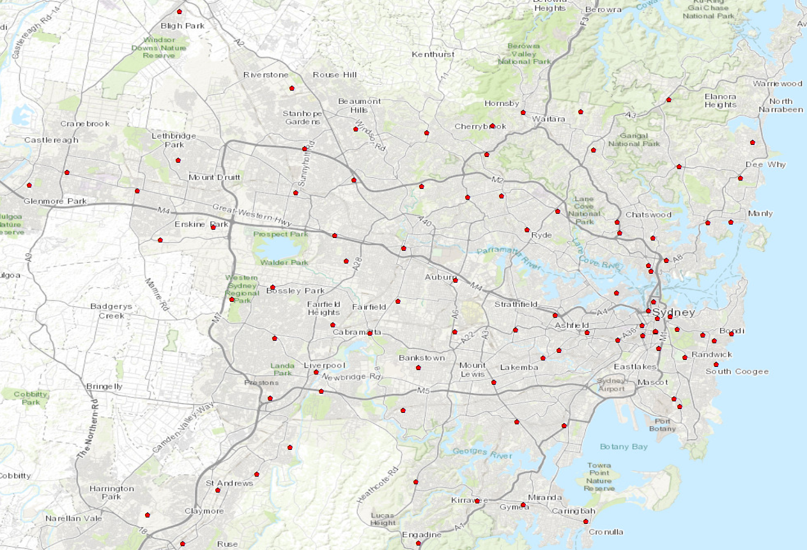
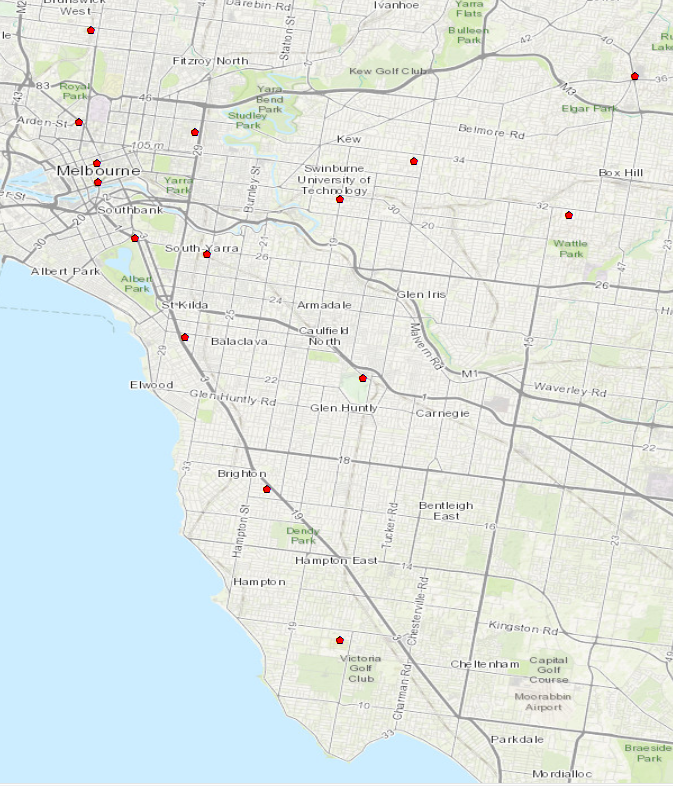
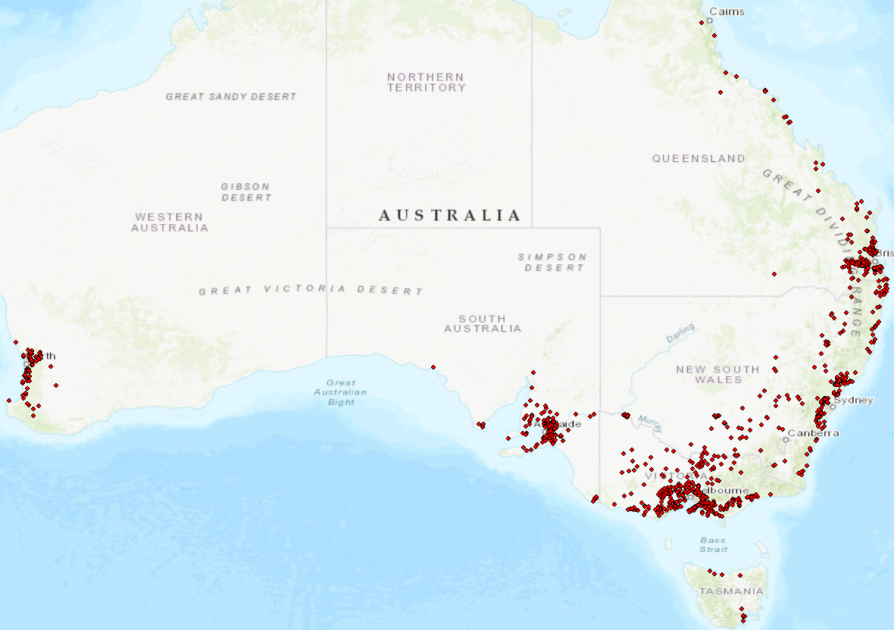

# Radio Altimeter Historical Data Analysis

Extract Unwired network data from Radex2000 database from 2010. Process data using pandas, create deployment summary from cleaned and sorted data.

## List of Required Summary Statistics

- Table of licensed bandwidths
- Bandwidth Distribution
- Transmitter Power into Antenna
- Transmitter Power Distribution (W + dBm/Hz)
- Antenna Gain Distribution
- EIRP (W + dBm/Hz)
- Distribution of Deployment heights
- ArcMap plot of Deployments

### Unwired - Map of Deployments in Sydney 2010

### Unwired - Map of Deployments in Melbourne 2010

### NBN FWA - Map of Deployments in Australia 2017

